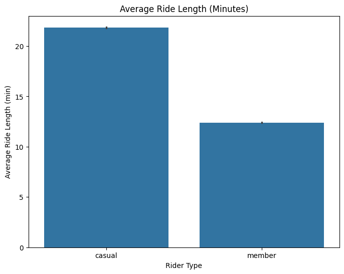
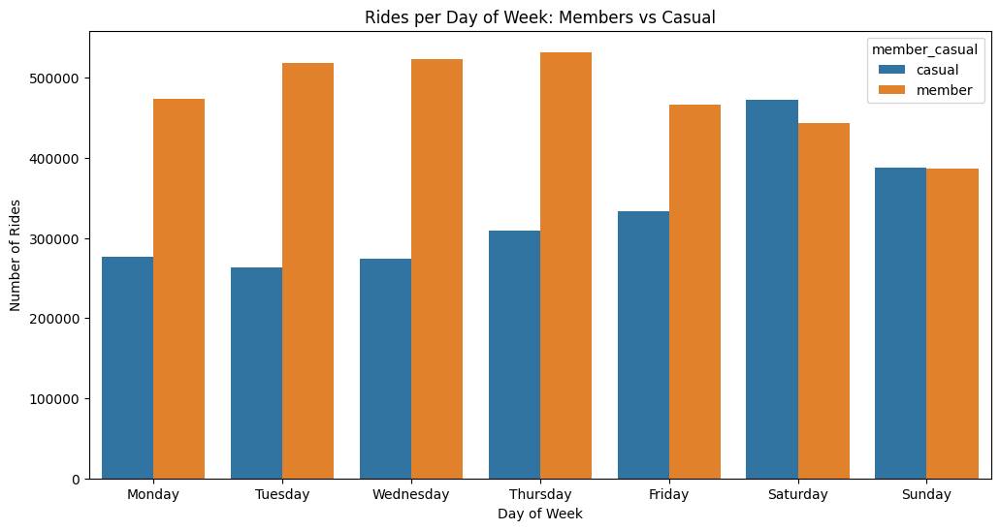
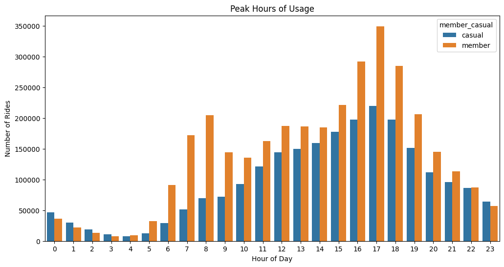
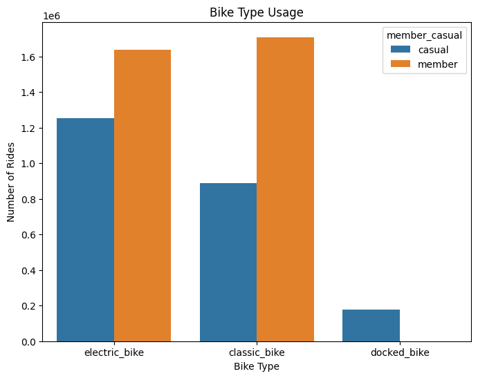
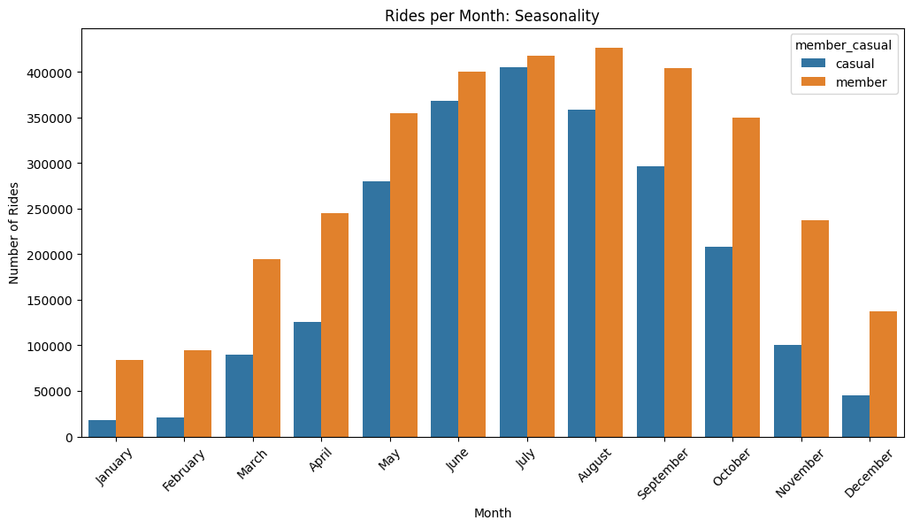

# Cyclistic-Case-Study
Data analysis case study exploring Cyclistic bike-share usage patterns using Python and Google Colab.

Cyclistic Bike-Share Case Study
A data analysis project completed as part of the Google Data Analytics Certificate.

Project Overview
This case study analyzes how annual members and casual riders use Cyclistic bike-share services differently.
The goal is to identify insights that can help Cyclistic convert more casual riders into annual members.

This project follows the full data analysis process:
Ask → Prepare → Process → Analyze → Share → Act

Project Files
Cyclistic_Analysis.ipynb — Full analysis notebook

images/ — Visualizations used in the report

README.md — Project summary (this file)

Tools Used
Python (Pandas, NumPy, Matplotlib, Seaborn)

Google Colab

Jupyter Notebook

GitHub

Tableau (optional for dashboards)

Key Questions

How do annual members and casual riders differ in their riding behavior?

What patterns appear in ride length, day of week, and bike type?

What insights can help Cyclistic increase membership conversions?

Data Sources
Publicly available Cyclistic trip data (12 months).
Data includes:

Ride start/end times

Ride length

User type (member vs casual)

Bike type

Station information

Key Insights

Casual riders take longer rides on average than members.

Members ride more frequently, especially on weekdays.
Casual riders prefer weekends, suggesting leisure-based usage.

Members peak during morning and evening commute times.  
Casual riders peak in the afternoon and early evening, especially on weekends.

Classic bikes are used more by members, while casual riders use more electric bikes.

Seasonal patterns show higher casual usage in warmer months.

Visualizations

Ride Length Comparison

Rides by Day of Week

Peak Hours of Usage

Bike Type Usage

Monthly Usage Trends

Recommendations

Offer weekend membership promotions targeting casual riders.

Create loyalty rewards for frequent casual users.

Improve marketing at popular tourist stations.

Optimize bike distribution during peak hours.

Highlight the cost savings of membership for long rides.

Conclusion

This analysis reveals clear differences between casual and member riders. Members use Cyclistic for consistent weekday commuting, while casual riders use the service mainly for weekend leisure and longer recreational trips. Understanding these patterns allows Cyclistic to design targeted marketing strategies, improve service availability, and create membership offerings that better meet the needs of both groups.

Contact

If you'd like to discuss this project or explore collaboration opportunities, feel free to reach out:

Moussa  
Aspiring Data Analyst

GitHub:  github.com/moussa97barry-lab/Cyclistic-Case-Study
LinkedIn: linkedin.com/in/bary-moussa-246392303
